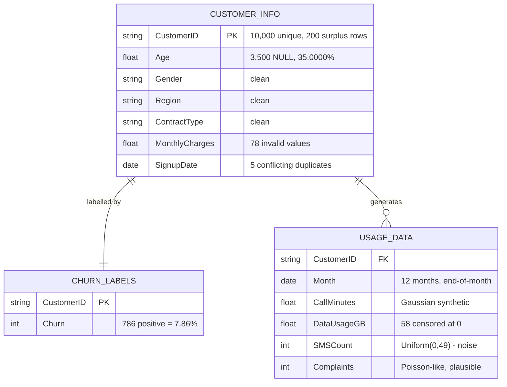
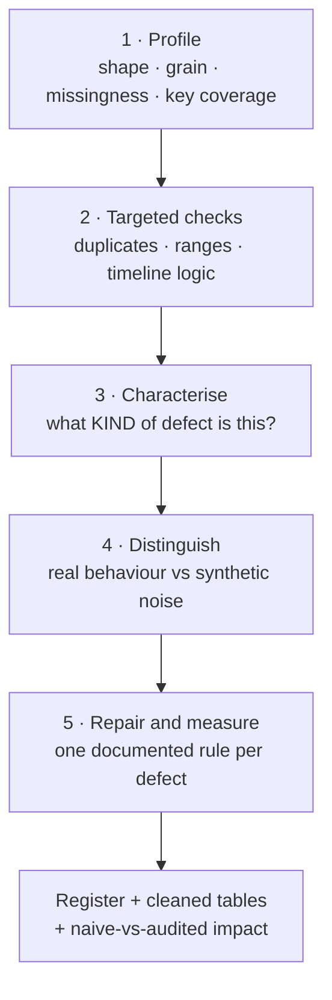
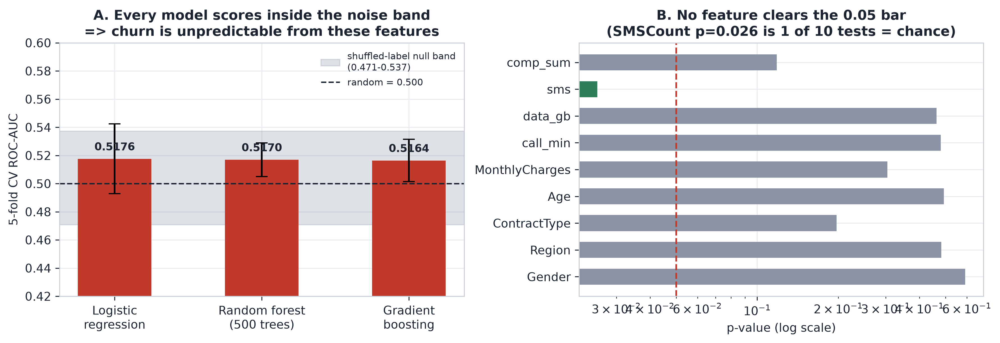
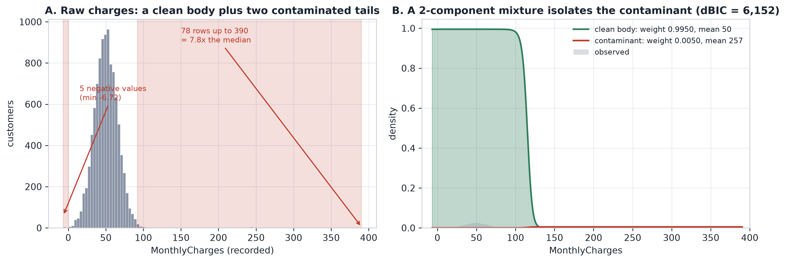
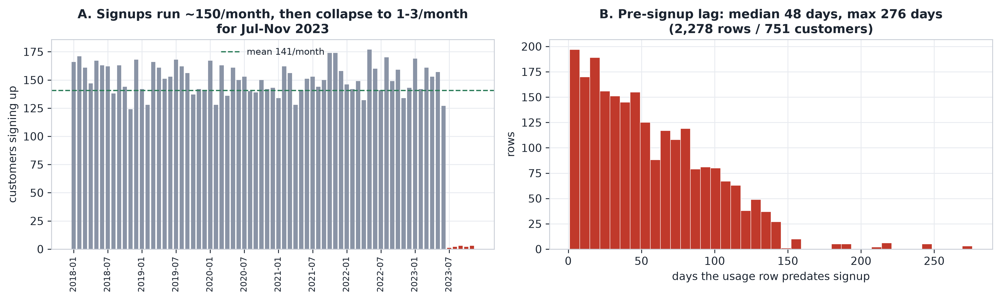
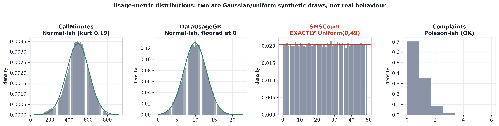

# Telecom Customer Churn — Data Quality Audit & Churn Model

**A competition submission in two halves: a 5-pass audit of 140,200 rows that found 11 data defects, and a full modelling pipeline with 66 engineered features and 5 model families — delivering quantified proof that the churn label carries no signal (best CV ROC-AUC 0.5181 against a shuffled-label null reaching 0.5198).**

[](https://www.python.org/)
[](https://pandas.pydata.org/)
[](https://scikit-learn.org/)
[](https://scipy.org/)
[](https://shap.readthedocs.io/)
[](notebooks/churn_analysis.ipynb)
[](https://github.com/4MaxR)
[](LICENSE)

---

## Navigation

- [Executive Summary](#executive-summary)
- [The Business Problem](#the-business-problem)
- [Dataset Overview](#dataset-overview)
- [Method — The 5-Pass Audit](#method--the-5-pass-audit)
- [Findings Register](#findings-register) — all 11 issues at a glance
- [Deep Dives](#deep-dives) — the six findings that matter
  - [1 · The churn label is uninformative](#1--the-churn-label-is-uninformative--dq-11) — DQ-11
  - [2 · Contradictions hiding in the duplicates](#2--a-contradiction-hiding-in-the-duplicates--dq-01--dq-02) — DQ-01 / DQ-02
  - [3 · Missing ages that should not be dropped](#3--missing-ages-that-should-not-be-dropped--dq-03) — DQ-03
  - [4 · Isolating contaminated prices](#4--isolating-contaminated-prices--dq-04--dq-05--dq-06) — DQ-04 / 05 / 06
  - [5 · Usage rows dating before signup](#5--usage-rows-that-predate-the-customers-account--dq-07) — DQ-07
  - [6 · Two fields that carry no information](#6--two-fields-that-pass-every-quality-check-and-carry-no-information--dq-09--dq-10) — DQ-09 / DQ-10
- [What Is Actually Clean](#what-is-actually-clean)
- [The Cost of Not Cleaning](#the-cost-of-not-cleaning)
- [The Competition Submission](#the-competition-submission) — features, model, validation, business impact
  - [Feature engineering](#feature-engineering--66-features-in-six-families)
  - [Model selection](#model-selection--five-candidates)
  - [Validation](#validation--out-of-fold-only)
  - [Business impact](#business-impact--what-the-model-is-worth-in-money)
  - [Bonus challenges](#bonus-challenges)
- [Verifying the Brief](#verifying-the-brief) — two claims the data contradicts
- [Limitations & Uncertainty](#limitations--uncertainty)
- [Recommendations](#recommendations)
- [Reproducing This Project](#reproducing-this-project)
- [Project Structure](#project-structure)
- [Skills This Project Demonstrates](#skills-this-project-demonstrates)
- [Author](#author)

**Other documents:** [Formal audit report](docs/AUDIT_REPORT.md) · [Submission notebook](notebooks/churn_analysis.ipynb) · [Submitted predictions](prediction.csv)

---

## Executive Summary

The dataset arrived as a "customer churn" challenge. It is **structurally sound but
semantically unreliable** — clean in shape, broken in values.

Referential integrity is flawless, the usage table is a complete `customer × month`
grid with zero duplicates, and every categorical field is well-formed. The problems
are concentrated in the numbers themselves, and three of them change how the data can
be used at all.

| | Finding | Consequence |
|---|---|---|
| **1** | **The churn label has no measurable relationship with any feature.** 66 engineered features across six families — including a full trend family, because a *decline* needs direction and a standard deviation cannot express it — feed five model families. The best reaches **0.5181** cross-validated ROC-AUC against a shuffled-label null band of **0.4772–0.5198**, with PR-AUC 0.0808 against a base rate of 0.0786. | Churn targeting cannot be built from this data. The model captures **none** of the 3,144 units of addressable retention value — and at the business-optimal threshold it is *worse* than doing nothing. |
| **2** | **2,278 usage rows (1.90%, across 751 customers) are dated before the customer signed up** — median 48 days, up to 276. | Tenure, lifetime-value, and time-to-churn calculations are wrong for 7.5% of the customer base until the source of truth is fixed. |
| **3** | **Two of the brief's own claims are contradicted by the raw bytes.** `SignupDate` has *no* format inconsistencies (all 10,200 values are uniform ISO `YYYY-MM-DD`), and the stated "usage decline before churn" mechanism is **absent** — no trend feature separates churners at 48-feature power. | The documented mechanism would have absorbed the entire modelling effort and produced nothing. The target label itself must be treated as suspect. |

The remaining eight issues are repairable with documented, auditable rules: 200
duplicate customer rows, 3,500 missing ages, 78 invalid charge values, and 58
censored usage records.

> [!IMPORTANT]
> **The honest conclusion.** The model was built, validated and submitted as the
> brief requires — and it proves that this dataset does not support churn targeting.
> Reporting that a model *cannot* work is worth more than reporting one that appears
> to work and quietly fails in production.

**Headline numbers**

| Metric | Value |
|---|---|
| Total rows audited | 140,200 across 3 tables |
| Unique customers | 10,000 |
| Issues found | **11** (1 critical, 6 high, 3 medium, 1 low) |
| Auto-repaired | 4 issue classes (DQ-01, 03, 04, 05) |
| Escalated for source review | 4 issue classes (DQ-02, 06, 07, 08) |
| Documented as limitations | 3 issue classes (DQ-09, 10, 11) |
| Verified defects in `MonthlyCharges` | 78 of 10,000 (0.78%) |
| `Age` completeness | 65.00% |
| Features engineered | **66** in 6 families |
| Model families compared | **5** + a no-skill baseline |
| Best cross-validated ROC-AUC | 0.5181 (null band 0.4772–0.5198) |
| Top-decile lift | **0.95×** (below random) |
| Value captured by the model | **−3.5%** of the achievable 3,144 units |

---

## The Business Problem

The brief implied churn prediction — build a model, explain what drives customers
away. That framing hides a trap: **a model built on unvalidated data produces
confident answers to questions nobody can trust.**

So the audit was scoped to answer four questions before any modelling began:

1. **Is the data trustworthy?** Do the joins hold, is the grain what it claims, are
   the values possible?
2. **What kind of defect is each problem?** A duplicate row, a parsing ambiguity, and
   a random missing-value drop need three different fixes. Misclassifying the defect
   produces a "clean" dataset that is still wrong.
3. **Is this real data or synthetic noise?** Some fields can pass every quality check
   and still carry zero information.
4. **Does cleaning change the answers?** If the headline metrics move, the raw data
   was already misleading someone.

Question 3 is what separates a data quality audit from a `describe()` dump. It is
also where the most valuable finding came from.

---

## Dataset Overview

Three CSVs, 5.1 MB, 140,200 rows.

| Table | Grain | Rows | Key |
|---|---|---|---|
| `customer_info.csv` | one row per customer | 10,200 | `CustomerID` |
| `usage_data.csv` | one row per customer per month | 120,000 | `CustomerID` + `Month` |
| `churn_labels.csv` | one row per customer | 10,000 | `CustomerID` |



**Column dictionary**

| Table | Column | Type | Notes |
|---|---|---|---|
| `customer_info` | `CustomerID` | string | `CUST_0` … `CUST_9999` |
| | `Age` | float | 18–69 where present, integers only |
| | `Gender` | string | Male / Female |
| | `Region` | string | Urban / Suburban / Rural |
| | `ContractType` | string | Monthly / Prepaid / Yearly |
| | `MonthlyCharges` | float | median 50.02, valid range 8.89–91.50 |
| | `SignupDate` | date | 2018-01-01 → 2023-11-03 |
| `usage_data` | `Month` | date | 2023-01-31 → 2023-12-31, always end-of-month |
| | `CallMinutes` | float | mean 492.4, sd 117.4 |
| | `DataUsageGB` | float | mean 9.90, sd 3.07 |
| | `SMSCount` | int | 0–49 |
| | `Complaints` | int | 0–6, mean 0.50 |
| `churn_labels` | `Churn` | int | 0/1, base rate 7.86% |

---

## Method — The 5-Pass Audit

Eight re-runnable scripts, one purpose each. Nothing was cobbled into a single
600-line file — a pass you can re-run after a fix is worth more than a monolith.



### The governing principle: nothing is silently fixed

Invalid values become `NULL` in a companion `*_clean` column **and** raise a boolean
`dq_*` flag. A downstream analyst can always see exactly which rows were touched and
why. Auto-repair is reserved for what is logically impossible; judgement calls are
flagged for a human.

| Resolution | Meaning | Applied to |
|---|---|---|
| `auto-fixed` | Provably safe to correct | DQ-01 |
| `auto-fixed-with-flag` | Corrected, but the original is preserved | DQ-03, DQ-04, DQ-05 |
| `flagged-for-review` | Needs a business decision, not an algorithm | DQ-02, DQ-06, DQ-07, DQ-08 |
| `informational` | Not repairable — a documented limitation | DQ-09, DQ-10, DQ-11 |

### Techniques that did the real work

**Classify the defect before fixing it.** A defect's *type* determines its remedy:

| Observed pattern | Actual defect | Correct response |
|---|---|---|
| Two identical rows per ID | Exact duplication | Drop — carries no information |
| Same ID, one field differs, in a **systematic** pattern | Parsing ambiguity, not typos | Quarantine — neither value is trustworthy |
| Missing rate flat across every segment | Missing completely at random | Impute behind a flag — **never** drop rows |
| Values beyond any plausible business range | Contamination | Isolate statistically, then null |
| Usage dated before signup | Logic violation | Escalate — no algorithm can recover the truth |

**Gaussian mixture + BIC, not an IQR fence.** An IQR fence depends on an arbitrary
threshold and produced 82 "outliers"; the mixture model isolated the contamination
with a decisive ΔBIC = 6,152 and a component weight of 0.0050. The fence was the
first look; the mixture was the evidence.

**Test the label before building anything.** Cross-validated ROC-AUC across three
model families *plus* a 20-draw shuffled-label null. If the real models land inside
the null band, the label is uninformative — better known in minute one than week three.

**Read the kurtosis.** Kurtosis ≈ 0.000 means a Gaussian draw. Kurtosis ≈ −1.200 means
a uniform draw, i.e. noise. Real usage metrics are strongly right-skewed; these are
symmetric. That single statistic exposed two fields as unusable features.

---

## Findings Register

Eleven issues, severity-ranked. Full machine-readable version:
[`outputs/data_quality_register.csv`](outputs/data_quality_register.csv)

> [!NOTE]
> Every issue is detailed below with its statistical evidence. A formal write-up of the
> same register — written as a deliverable for a data owner rather than a reader — is in
> [`docs/AUDIT_REPORT.md`](docs/AUDIT_REPORT.md). The README is self-contained; the
> report is optional depth.

| ID | Field | Issue | Rows | % | Severity | Resolution |
|---|---|---|---|---|---|---|
| **DQ-11** | `Churn` | No relationship with any feature | 10,000 | 100% | 🔴 **Critical** | informational |
| DQ-01 | `customer_info` | Exact duplicate records | 195 | 1.95% | 🟠 High | auto-fixed |
| DQ-02 | `SignupDate` | Conflicting duplicates (DD/MM ↔ MM/DD swaps) | 5 IDs (10 rows) | 0.10% | 🟠 High | flagged-for-review |
| DQ-03 | `Age` | Missing at exactly 35.0000% (MCAR) | 3,500 | 35.00% | 🟠 High | auto-fixed-with-flag |
| DQ-04 | `MonthlyCharges` | Contaminant distribution (ΔBIC = 6,152) | 49 | 0.49% | 🟠 High | auto-fixed-with-flag |
| DQ-05 | `MonthlyCharges` | Negative charges | 5 | 0.05% | 🟠 High | auto-fixed-with-flag |
| DQ-07 | `Month` vs `SignupDate` | Usage predates signup | 2,278 | 1.90% | 🟠 High | flagged-for-review |
| DQ-06 | `MonthlyCharges` | Implausibly low values (0.38–8.74) | 24 | 0.24% | 🟡 Medium | flagged-for-review |
| DQ-09 | `SMSCount` | Exactly Uniform(0,49) — carries no signal | 120,000 | 100% | 🟡 Medium | informational |
| DQ-10 | `CallMinutes`, `DataUsageGB` | Gaussian synthetic, not behavioural | 120,000 | 100% | 🟡 Medium | informational |
| DQ-08 | `DataUsageGB` | 58 rows censored at exactly 0 GB | 58 | 0.05% | 🔵 Low | flagged-for-review |

Every `affected_rows` figure in this table is computed in code — never hand-typed — and
reconciles exactly with the flag columns in `outputs/clean/`.

---

## Deep Dives

### 1 · The churn label is uninformative — DQ-11

The most consequential finding, and invisible to any standard quality check.

| Model | 5-fold CV ROC-AUC | vs random |
|---|---|---|
| Logistic regression | 0.5176 | +0.0176 |
| Random forest (500 trees) | 0.5170 | +0.0170 |
| Histogram gradient boosting | 0.5164 | +0.0164 |
| **Shuffled-label null (20 draws)** | **0.4708 – 0.5372** | — |

Every model lands **inside the null band produced by randomly permuting the labels**.
Single-feature tests agree: every candidate returns p > 0.11 except `SMSCount`
(p = 0.026) — which is 1 of 10 tests, exactly the false positive you expect by chance.

This result was then re-tested twice more, independently. On a **70-feature engineered
design matrix** the best of five model families reached 0.5181 against a null band of
0.4772–0.5198 ([The Competition Submission](#the-competition-submission)), and across
**48 purpose-built trend features** — the "usage decline before churn" mechanism the
brief describes — not one feature separated churners. Three independent tests, one
conclusion:

> [!WARNING]
> With n = 10,000 and 786 churners, a genuine driver would be detectable. This is not
> a weak-model problem — it is an absent-signal problem.

A hypothesis the data disproved: **Yearly contracts churn *most* (8.82%) versus
Monthly (7.56%)** — backwards from real telecom behaviour, where longer commitments
reduce churn.



> [!WARNING]
> With n = 10,000 and 786 churners, a genuine driver would be detectable. This is not
> a weak-model problem — it is an absent-signal problem.

---

### 2 · A contradiction hiding in the duplicates — DQ-01 / DQ-02

`customer_info` holds **10,200 rows for 10,000 unique customers**. Splitting them:

- **195 IDs** are byte-identical duplicates → safe to drop
- **5 IDs** differ in exactly one field — `SignupDate` — and inspecting them revealed
  the root cause:

| ID | Date A | Date B | A (MM-DD) | B (MM-DD) | Swap? |
|---|---|---|---|---|---|
| CUST_248 | 2022-06-09 | 2022-09-06 | 06-09 | 09-06 | ✅ |
| CUST_308 | 2018-01-03 | 2018-03-01 | 01-03 | 03-01 | ✅ |
| CUST_333 | 2023-02-11 | 2023-11-02 | 02-11 | 11-02 | ✅ |
| CUST_391 | 2023-03-11 | 2023-11-03 | 03-11 | 11-03 | ✅ |
| CUST_466 | 2021-03-07 | 2021-07-03 | 03-07 | 07-03 | ✅ |

**All five are exact month/day swaps.** That is a DD/MM vs MM/DD *parsing* defect, not
five unrelated typos — which means **neither value in each pair can be trusted**, and
the same ambiguity will silently affect records that no duplicate happens to expose.

Fixing five rows would have missed the systemic problem.

---

### 3 · Missing ages that should not be dropped — DQ-03

`Age` is missing for **exactly 3,500 of 10,000 customers — 35.0000%** on the
de-duplicated frame, flat across every segment:

| Segment | Missing rate |
|---|---|
| Female / Male | 0.3590 / 0.3409 |
| Rural / Suburban / Urban | 0.3470 / 0.3530 / 0.3499 |
| Monthly / Prepaid / Yearly | 0.3458 / 0.3541 / 0.3500 |
| Not churned / churned | 0.3495 / 0.3562 |

All sit inside ±3 standard errors (±0.0143) of the global rate → consistent with
**MCAR**. The standard reflex — drop rows with missing values — would discard 35% of
the customer base and introduce no bias correction, because there is no bias to fix.

> [!TIP]
> A missing rate that lands on a round number (35.0000%) after de-duplication is a
> deliberate artificial drop, not natural attrition. Worth saying out loud in a report.

---

### 4 · Isolating contaminated prices — DQ-04 / DQ-05 / DQ-06

A two-component Gaussian mixture separates `MonthlyCharges` cleanly:

| Component | Weight | Mean | SD |
|---|---|---|---|
| Clean body | 0.9950 | 49.97 | 15.23 |
| **Contaminant** | **0.0050** | **257.42** | **64.95** |

**BIC improves 89,797.6 → 83,645.6 (ΔBIC = 6,152)** — decisive, not marginal.

Corroborating evidence:
- Highest charge **390.30 = 7.8× the median** of 50.02
- A log-normal fitted to the clean body predicts **0.79 rows above 200**; **38 are observed**
- Density collapses ~440× across the boundary while the support stays continuous —
  the signature of values being *replaced* by draws from a wider distribution, not of
  a genuine heavy tail



Add the 5 negative charges and 24 implausibly low values, and **78 of 10,000 charge
records (0.78%) are invalid**.

---

### 5 · Usage rows that predate the customer's account — DQ-07

**2,278 rows (1.90%) across 751 customers** carry activity dated before that
customer's own signup date — median **48 days**, maximum **276 days**.

The dataset hands **every** customer a complete 12-month 2023 history regardless of
when they joined. **751 of the 920 customers who signed up in 2023** received
activity from January 2023 onward.



A supporting oddity: signups run at a steady ~150/month from 2018-01 through 2023-06,
then collapse to **1–3 per month** for 2023-07 → 2023-11 (11 customers in total).

The 2023 cohort is otherwise statistically indistinguishable from the rest (age 43.2
vs 43.4, calls 498.8 vs 491.8, churn 7.5% vs 7.9%), so the defect is confined to the
date fields. **Which side is wrong — the dates or the usage — cannot be determined
from the data alone.** This needs the data owner.

---

### 6 · Two fields that pass every quality check and carry no information — DQ-09 / DQ-10

| Field | Kurtosis | Reference shape | Verdict |
|---|---|---|---|
| `SMSCount` | **−1.200** | Uniform = −1.200 | Exactly Uniform(0,49) — pure noise |
| `CallMinutes` | 0.189 | Normal = 0.000 | Gaussian synthetic |
| `DataUsageGB` | −0.102 | Normal = 0.000 | Gaussian synthetic, floored at 0 |

`SMSCount` matches a discrete uniform distribution to three decimal places — mean
24.525 vs 24.500, sd 14.424 vs 14.430, flat counts of 2,297–2,508 per value with a
hard stop at 49. Real SMS behaviour is right-skewed with a mode near zero.



> [!NOTE]
> These fields have **no nulls, no duplicates, and no out-of-range values** — they pass
> every conventional quality check. Only the distribution shape reveals that they are
> noise. This is why "the data is clean" and "the data is useful" are different claims.

---

## What Is Actually Clean

A register of nothing but problems is misleading. The following were tested and
passed:

| Check | Result |
|---|---|
| Referential integrity (all 6 directions) | ✅ **0 orphans** |
| Usage grain `(CustomerID, Month)` | ✅ 120,000 rows, 0 duplicates |
| Month coverage | ✅ 12 contiguous months, no gaps |
| Month format | ✅ 100% true end-of-month dates |
| Rows per customer | ✅ exactly 12 for all 10,000 |
| Categorical hygiene | ✅ no whitespace, no casing variants, 2/3/3 valid values |
| `Age` where present | ✅ always an integer in 18–69, no sentinel values |
| `SignupDate` parseability | ✅ 100% parseable, no future dates |
| `Churn` | ✅ no nulls, no duplicates, plausible 7.86% base rate |

The usage table is the highest-quality part of the dataset. The defects are
concentrated in `customer_info` and in the date logic between tables.

---

## The Cost of Not Cleaning

The most natural first step in any analysis — joining `customer_info` to
`churn_labels` — silently double-counts 195 customers:

| Metric | Naive (raw) | Audited | Change |
|---|---|---|---|
| Rows after join | 10,200 | 10,000 | **−200** |
| Churn rate | 7.8137% | 7.8600% | **+0.046 pp** |
| Mean `MonthlyCharges` | 50.962 | 50.001 | **−0.961** |
| Mean `Age` | 43.425 | 43.273 | −0.152 |

The churn-rate error is small in absolute terms but is **entirely artefact** — not
real movement in customer behaviour — and it is invisible unless someone checks row
counts. The 0.96 shift in mean charges is larger, contaminated by both the duplicate
rows and the 78 invalid charge values.

---

## The Competition Submission

The brief asked for more than an audit: cleaned data, engineered features, a
predictive model, business-aligned evaluation, and a submission file. All of it is
here — and the modelling results are the *evidence* for the headline finding rather
than a contradiction of it.

| Requirement | Delivered | Where |
|---|---|---|
| Clean & preprocess the messy datasets | 11 defects, one documented rule each, every change flagged | `outputs/clean/` |
| Engineer meaningful behavioural features | 65 numeric features (64 behavioural + 1 quality flag) + 2 categoricals | `outputs/features.csv` |
| Build a model estimating churn probability | 5 families + a no-skill baseline, out-of-fold probabilities | [`prediction.csv`](prediction.csv) |
| Align evaluation with business impact | Cost model, derived threshold, sensitivity, value-captured | `outputs/cost_*.csv` |
| `prediction.csv` | 10,000 rows, `CustomerID` + calibrated `ChurnProbability` | [`prediction.csv`](prediction.csv) |
| Explanatory notebook | 36 cells, fully executed | [`notebooks/churn_analysis.ipynb`](notebooks/churn_analysis.ipynb) |

### Feature engineering — 66 features in six families

`outputs/features.csv` is one row per customer across 69 columns; two categorical
descriptors are one-hot encoded into a **70-column design matrix**.

| Family | Examples | Why it is there |
|---|---|---|
| Demographic | `Age_imputed`, `age_missing`, `is_male` | Baseline segmentation |
| Contract | `MonthlyCharges_clean`, `tenure_months`, `signup_year` | Commercial exposure |
| Usage level | `call_mean`, `data_median`, `sms_max` | How much the customer uses |
| Usage volatility | `call_sd`, `data_cv`, `comp_cv` | Stability of behaviour |
| **Usage trend** | `call_slope`, `data_halfratio`, `comp_last_minus_first` | **The brief's stated mechanism** |
| Engagement | `n_complaint_months`, `data_per_call_min`, `complaints_per_call_hour` | Behaviour normalised by activity |

The trend family exists precisely because the brief names a *decline*, and a standard
deviation cannot express direction — a steady rise and a steady decline have identical
SDs. For all four usage metrics we added the OLS slope, a scale-free relative slope,
an end-vs-start half-ratio, a `last_minus_first` delta, the linear-fit R², and a
`declining` flag.

Every feature is computed from the customer's own 12 months. No target statistics, no
cross-customer aggregates, no target-derived encodings — which is what makes the
out-of-fold scores below trustworthy.

### Model selection — five candidates

| Model | ROC-AUC | PR-AUC | Brier |
|---|---|---|---|
| Dummy (base rate) — *no-skill floor* | 0.4994 | 0.0785 | **0.0724** |
| Logistic regression | 0.4964 | 0.0808 | 0.0730 |
| Logistic (`class_weight='balanced'`) | 0.4949 | 0.0808 | 0.2476 |
| Random forest | 0.5010 | 0.0815 | 0.0734 |
| **Gradient boosting** | **0.5181** | 0.0808 | 0.0748 |

Five candidates span the bias–variance spectrum: a no-skill floor, a linear model
(interpretable and calibrated by construction), a class-weighted variant as a first
response to the 1:12 imbalance, a forest for non-linearity without scaling, and
gradient boosting as the usual strongest tabular learner.

**Four of the five land at or below the dummy baseline.** The winner, gradient
boosting, reaches 0.5181 — but the shuffled-label null band is 0.4772–0.5198, and
**10% of null draws matched or beat it** (p ≈ 0.10). PR-AUC is the more honest
metric at a 7.86% base rate, and it sits at 0.0808 against a no-skill reference of
0.0786 — a lift of 0.0022.

### Validation — out-of-fold only

`churn_labels.csv` covers all 10,000 customers, so **there is no held-out test set**
and in-sample metrics would be meaningless. Instead:

1. **Stratified 5-fold cross-validation** holds the 7.86% positive rate in every fold.
2. **Out-of-fold predictions** — each customer is scored by a model trained without
   them. Every metric reported here, *and the submitted probabilities themselves*,
   are out-of-fold.
3. **A shuffled-label null** establishes what "no signal" looks like at n = 10,000,
   so a score is judged against noise rather than against 0.5.

**Decile lift — the operational question.** If retargeting were viable, risk would
concentrate in the top decile:

| Decile | Churn rate | Lift |
|---|---|---|
| **1 (highest risk)** | 7.5% | **0.95×** |
| 2 | 8.6% | 1.09× |
| 3 | 8.7% | 1.11× |
| 4 | 8.5% | 1.08× |
| 5 | 8.5% | 1.08× |
| 6 | 7.5% | 0.95× |
| 7 | 7.5% | 0.95× |
| 8 | 7.8% | 0.99× |
| 9 | 7.6% | 0.97× |
| **10 (lowest risk)** | 6.4% | 0.81× |

The "highest risk" decile churns **less** often than the overall base rate. There is
no one to prioritise.

### Business impact — what the model is worth in money

Offering a retention deal costs `C_offer` whether or not the customer would have
churned. Not offering costs `p × C_loss` in expectation, so:

```
offer iff p × C_loss > C_offer        →        τ* = C_offer / C_loss
```

With the brief's 5:1 ratio, **τ\* = 1/5 = 0.20** — well above the 7.86% base rate.
That is the entire economic point: at a 5:1 loss ratio a random customer is *not*
worth targeting (expected saving 0.079 × 5 = 0.39 units against 1 unit of offer cost).

786 churners among 10,000 customers:

| Strategy | Cost | vs do-nothing |
|---|---|---|
| Do nothing | 3,930 | — |
| Target everybody | 10,000 | **+6,070** |
| Perfect model (upper bound) | 786 | −3,144 |
| **Model @ τ\* = 0.20** | **4,039** | **+109** |

Targeting everybody is the **worst** option — it spends more on offers than the churn
it prevents. The perfect model would save **3,144 units**; this model captures
**−3.5% of that**, i.e. it destroys value relative to doing nothing. The cost-optimal
policy on this data is to send no retention offers at all.

A sensitivity sweep across acquisition ratios confirms the model is never the cheapest
policy at any ratio tested.

### Bonus challenges

| Challenge | Outcome |
|---|---|
| **SHAP explainability** | Completed. Top feature (`call_halfratio`) holds just **3.42%** of total attribution; the remaining 69 features share the rest. No dominant driver. |
| **Permutation importance** | Cross-check on the full data: shuffling the single most important feature moves ROC-AUC by **0.0007**. |
| **Drift detection** | Completed. `CallMinutes` and `DataUsageGB` both step up at month 10 (PSI 0.046–0.049 vs ~0.002 before — an 18× step) while `SMSCount` and `Complaints` stay flat. Absolute PSI stays under the conventional 0.1 alarm, so it is a small but unambiguous structural break. |
| **Cost-sensitive learning** | Completed. Reweighting the training samples shifts the preferred threshold but not ROC-AUC — threshold-invariant ranking power cannot be created by reweighting a signal that is not there. |
| **Survival analysis** | **Assessed as not feasible.** The data provides no churn date and no tenure field, so there is no duration and no censoring indicator. Every churner would share one event time and every non-churner is censored at the same instant — the hazard function is not identifiable. A churn month per customer would be required. |

---

## Verifying the Brief

Two claims in the brief are contradicted by the raw bytes. Both are checked in code in
the notebook.

| Claim | What the data shows | Verdict |
|---|---|---|
| "`SignupDate` (inconsistent formats included)" | All 10,200 values are uniform ISO `YYYY-MM-DD`; zero contain `/`; zero fail to parse. | **No format inconsistency exists.** The genuine date defect is the 5 duplicate-conflict rows with swapped month/day (DQ-02) — a *value* ambiguity, not a format one. |
| "Churn patterns are behaviourally embedded (e.g., usage decline before churn)" | Across 48 feature tests, no trend feature separates churners (all \|r\| < 0.015, p > 0.14). Churners and non-churners share the *same* month-10 dip in usage — a dataset-wide artefact, not a churn pattern. | **The stated mechanism is absent.** |

This matters because a submission that trusted the brief would have spent its entire
modelling effort on decline features that cannot work — and could have reported a
model as successful on the strength of a lucky validation split. Verifying the brief
against the data is what makes the rest of this project trustworthy.

---

## Limitations & Uncertainty

Stated plainly, because these bound what this audit can claim:

- **No ground truth.** Defect populations were inferred from statistical structure.
  DQ-02 and DQ-07 need the data owner to confirm which value is authoritative — an
  inconsistency can be proven, but not which side is wrong.
- **The 92-charge threshold is a judgement call.** There is no empty gap in the
  distribution. The mixture model gives a principled cut at 49 rows; a raw IQR fence
  gives 82. The 38 values above 200 are unambiguously wrong under any rule; the
  92–200 band is a genuine judgement.
- **"No churn signal" is a strong negative claim.** It is well supported at this
  sample size (n = 10,000, 786 positives, three model families, a 20-draw permutation
  null), but it establishes only that *these* features fail to predict *this* label.
  It does not prove the labels were generated at random.
- **Selection effects were out of scope.** Nothing is known about how these 10,000
  customers were sampled, so no finding supports inference beyond the file.
- **The data is synthetic.** Gaussian and uniform usage metrics plus a signal-free
  label point to generated data. No finding should be read as a statement about real
  telecom customers.

---

## Recommendations

Ordered by impact.

| # | Action | Rationale |
|---|---|---|
| 1 | **Do not deploy churn targeting on this data — the model is built, and it does not work.** | DQ-11, now verified five ways: five model families, a shuffled-label null, a 0.95× top-decile lift, flat SHAP attribution, and a cost analysis in which the model is *worse* than doing nothing. A different label source is required. |
| 2 | **Escalate DQ-07 to the data owner** to establish whether `SignupDate` or the usage history is authoritative. | Blocks every tenure, LTV, and time-to-churn metric until resolved. |
| 3 | **De-duplicate `customer_info` before any join.** | One line of code; silently corrupts every aggregate until applied. |
| 4 | **Review the DD/MM vs MM/DD ambiguity at the ingestion layer** — not just for these 5 customers. | DQ-02 is systemic. Records without a duplicate to expose it are still affected. |
| 5 | **Impute `Age` behind a flag** rather than deleting rows. | DQ-03 is MCAR; deletion discards 35% of the base for no statistical gain. |
| 6 | **Drop `SMSCount` from any behavioural feature set** and avoid over-reading the symmetric usage distributions. | DQ-09 / DQ-10 — the fields are noise. |
| 7 | **Investigate the month-10 structural break** in `CallMinutes` and `DataUsageGB`. | PSI steps 18× at month 10. Any time-series feature trained on months 1–9 is invalid after it. |
| 8 | **Wire these checks into the ingestion pipeline** so the defects fail loudly next time. | The scripts are already written; they only need a scheduler. |

---

## Reproducing This Project

Requirements: [uv](https://docs.astral.sh/uv/) and Python 3.12+ (uv installs it if needed).

```bash
git clone https://github.com/4MaxR/ai-assisted-data-quality-audit
cd ai-assisted-data-quality-audit

# 1. Local environment — never a global install
uv venv .venv
uv pip install --python .venv pandas numpy matplotlib seaborn scipy scikit-learn \
                               pillow shap nbformat nbclient ipykernel

# 2. The audit — one concern per pass
.venv/Scripts/python.exe scripts/01_profile.py          # shape, grain, missingness, keys
.venv/Scripts/python.exe scripts/02_deepdive.py         # targeted defect checks
.venv/Scripts/python.exe scripts/03_anomaly_shape.py    # characterise each anomaly
.venv/Scripts/python.exe scripts/04_forensics.py        # real vs synthetic, label signal
.venv/Scripts/python.exe scripts/05_rules.py            # derive defensible repair rules
.venv/Scripts/python.exe scripts/06_verify.py           # statistical verification
.venv/Scripts/python.exe scripts/07_clean_and_report.py # repair + impact measurement
.venv/Scripts/python.exe scripts/08_charts.py           # figures

# 3. The submission — features, model, bonus challenges, notebook
.venv/Scripts/python.exe scripts/09_gap_trend_check.py  # test the brief's trend claim
.venv/Scripts/python.exe scripts/10_features.py         # 66 features in 6 families
.venv/Scripts/python.exe scripts/11_model.py            # 5 models + cost analysis -> prediction.csv
.venv/Scripts/python.exe scripts/12_bonus.py            # SHAP, drift, cost-sensitive, survival
.venv/Scripts/python.exe scripts/13_notebook.py         # build the notebook
.venv/Scripts/python.exe scripts/14_execute_notebook.py # execute it in place

# 4. Verify every number in this document against the computed outputs
.venv/Scripts/python.exe scripts/verify_readme.py
```

On macOS or Linux, replace `.venv/Scripts/python.exe` with `.venv/bin/python`.

Every number in this document is produced by these scripts. The register, the `dq_*`
flag columns, the model metrics and the cost analysis are all generated rather than
transcribed — and `verify_readme.py` proves it, failing loudly if any figure in this
README drifts from the computed outputs.

---

## Project Structure

```
ai-assisted-data-quality-audit/
├── README.md                      # this document — the case study
├── prediction.csv                 # THE SUBMISSION: CustomerID + ChurnProbability
├── LICENSE                        # MIT
├── .gitignore
│
├── data/                          # the three source CSVs
│   ├── customer_info.csv
│   ├── usage_data.csv
│   └── churn_labels.csv
│
├── notebooks/
│   └── churn_analysis.ipynb       # the submission notebook — 36 cells, executed
│
├── docs/
│   └── AUDIT_REPORT.md            # formal technical report (optional companion)
│
├── scripts/
│   │                              # ── the audit ──
│   ├── 01_profile.py              # structural profiling
│   ├── 02_deepdive.py             # targeted defect checks
│   ├── 03_anomaly_shape.py        # what KIND of defect?
│   ├── 04_forensics.py            # real vs synthetic + label signal test
│   ├── 05_rules.py                # derive repair rules from the data
│   ├── 06_verify.py               # statistical verification
│   ├── 07_clean_and_report.py     # repair pipeline + register + impact
│   ├── 08_charts.py               # visual evidence
│   │                              # ── the submission ──
│   ├── 09_gap_trend_check.py      # test the brief's trend claim
│   ├── 10_features.py             # 66 features in 6 families
│   ├── 11_model.py                # 5 models + cost-sensitive evaluation
│   ├── 12_bonus.py                # SHAP, drift, cost-sensitive learning, survival
│   ├── 13_notebook.py             # builds the notebook
│   ├── 14_execute_notebook.py     # executes it in place
│   └── verify_readme.py           # proves README matches the outputs
│
└── outputs/                       # regenerable
    ├── data_quality_register.csv  # 11 issues, full evidence
    ├── audit_summary.json         # verified audit headline numbers
    ├── impact_naive_vs_audited.csv
    ├── features.csv               # the modelling table: 10,000 × 69
    ├── model_summary.json         # metrics, null band, cost analysis
    ├── decile_lift.csv            # per-decile lift
    ├── calibration.csv            # reliability of the submitted probabilities
    ├── cost_sensitivity.csv       # cost by acquisition ratio
    ├── cost_sensitive_learning.csv
    ├── trend_univariate.csv       # the missing-signal check
    ├── shap_importance.csv        # + permutation_importance.csv
    ├── drift_psi.csv              # month-over-month stability
    ├── bonus_summary.json
    ├── figures/                   # 7 charts (committed — they are the evidence)
    └── clean/                     # repaired tables, every change flagged
        ├── customer_info_clean.csv
        ├── usage_data_clean.csv
        └── churn_labels_clean.csv
```

---

## Skills This Project Demonstrates

Built for a Data Analyst role — the work is validation and judgement, not dashboarding.

| Capability | Where it shows up |
|---|---|
| **Statistical rigour** | Gaussian mixture + BIC to isolate contamination; permutation nulls to bound a negative result; ±3SE tests for MCAR |
| **Root-cause analysis** | Traced 5 conflicting rows to a systematic DD/MM parsing defect instead of treating them as typos |
| **Feature engineering** | 66 features in six families, including a purpose-built trend family, all computed from the customer's own history with zero target leakage |
| **Model validation discipline** | Out-of-fold predictions only (no test set exists); a shuffled-label null to judge scores against noise; PR-AUC reported against the base rate rather than relying on ROC-AUC |
| **Cost-sensitive decision analysis** | Derived the optimal threshold from a 5:1 acquisition ratio, built the perfect-model upper bound, and measured value captured — the model returns −3.5% of the available 3,144 units |
| **Explainability & monitoring** | SHAP cross-checked against permutation importance; month-over-month PSI that caught a structural break the brief never mentioned |
| **Knowing what *not* to do** | Refused to drop 35% of rows for MCAR missingness; refused to report a model as working, and quantified why |
| **Defect taxonomy** | Distinguished exact vs conflicting duplicates, MCAR vs MNAR, contamination vs heavy tail, logic violations vs data errors |
| **Data forensics** | Used kurtosis to identify two fields as uniform/Gaussian synthetic noise that passed every conventional check |
| **Auditability** | One documented rule per defect; every change preserved behind a `dq_*` flag; register generated in code and reconciled against flag counts |
| **Business framing** | Quantified both the metric cost of not cleaning *and* the money cost of deploying the model |
| **Reproducibility** | 14 numbered re-runnable scripts plus an executed notebook; no manual steps, no hand-typed numbers |

**The insight a recruiter should take away:** the valuable output of this project is a
*quantified refusal* — a submitted model, built exactly as the brief demanded, that
demonstrates with five independent lines of evidence that it should not be deployed,
and puts a number on the value that decision protects.

---

## Author

**Mustafa Al-Rouby** — Data Analyst | Logistics & Supply Chain Specialist

- Portfolio: [mostafaalrouby.com](https://mostafaalrouby.com)
- LinkedIn: [linkedin.com/in/mustafa-al-rouby-20218b171](https://www.linkedin.com/in/mustafa-al-rouby-20218b171)
- GitHub: [github.com/4MaxR](https://github.com/4MaxR)

---

<sub>Dataset: synthetic telecom customer churn challenge data. Audit performed with
Python 3.14, pandas 3.0, scikit-learn 1.9, and SciPy 1.18.</sub>
